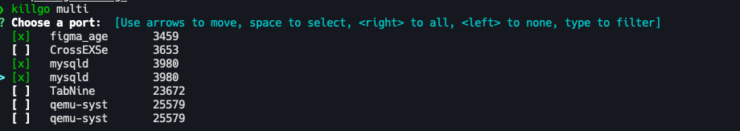

# killgo

you can kill port by using `killgo` that kill tool of tool.
this is using `lsof` of command, if you not install lsof, can't use killgo.



## install

```bash
go install github.com/cothi/killgo
```

## use

```bash
killgo --help

# kill port
killgo

# kill multiple port
killgo multi
```

#### TODO

1. [ ] support in various environments (mac, linux, window, etc)
2. [ ] fast process
